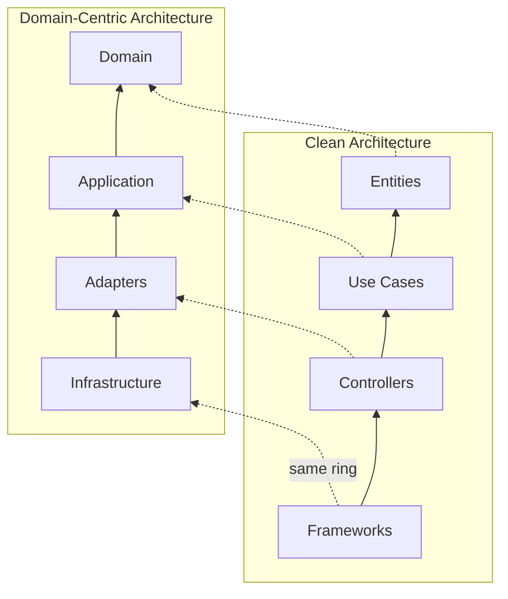

Both architectures share fundamental principles:

### 1. Dependency Rule

**Both agree:**
- All dependencies point inward
- Inner layers have zero dependencies on outer layers
- Core business logic is independent

The rings are the same and so is the direction — arrows point inward, and nothing inner knows
anything outer. The names differ, and one thing behind them does: what DCA calls Domain is a rich
model with aggregates and invariants, not only Entities.

### 2. Separation of Concerns

**Both agree:**
- Business logic separated from infrastructure
- Presentation separated from business logic
- Each layer has distinct responsibility

### 3. Testability

**Both agree:**
- Core business logic testable without infrastructure
- Use mocks/stubs for external dependencies
- Test pyramid: many unit tests, fewer integration tests

### 4. Framework Independence

**Both agree:**
- Business logic doesn't depend on frameworks
- Can swap frameworks without changing business logic
- Frameworks are "details"

### 5. Database Independence

**Both agree:**
- Business logic doesn't know about database
- Can swap database without changing business logic
- Persistence is a "detail"
