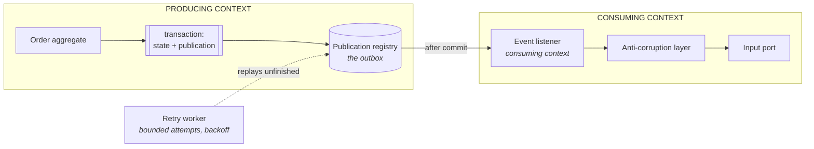
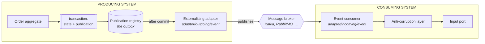

The pipeline above says nothing about deployment, and it does not have to. The publication is
written *inside* the aggregate's transaction either way, and delivery is asynchronous and at least
once either way. Only the leg in the middle differs.

**One deployable — in-process.** The registry is the outbox. A listener in the consuming context
picks the contract up after the commit; a retry worker replays what did not finish.

**Several deployables — over the wire.** The same registry, the same after-commit wakeup. What
changes is that an externalising adapter hands the contract to a broker, and the consumer runs an
incoming event adapter instead of a listener.

The contract is the same object in both pictures, and so is everything the domain and application
layers see. Moving from the left picture to the right one replaces one adapter and adds an
operational concern — it does not touch a use case, an aggregate or a contract. That is what makes
the modulith a starting point rather than a compromise.

The right-hand picture also buys a failure mode the left one does not have: the broker can accept a
message the producer never learns was accepted. Provider-side idempotency deduplicates the repeat;
without it, a duplicated external effect stays possible.
