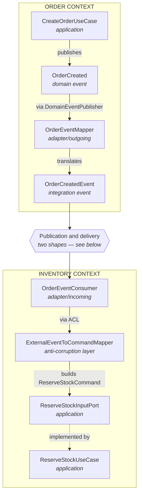

Neither context knows the other's model. What crosses the boundary is the
integration contract; the anti-corruption layer turns it into this context's own
command before any use case sees it.

## Related mentions (heuristic)

- [DomainEventPublisher](/marker/port-out/domaineventpublisher.md)
