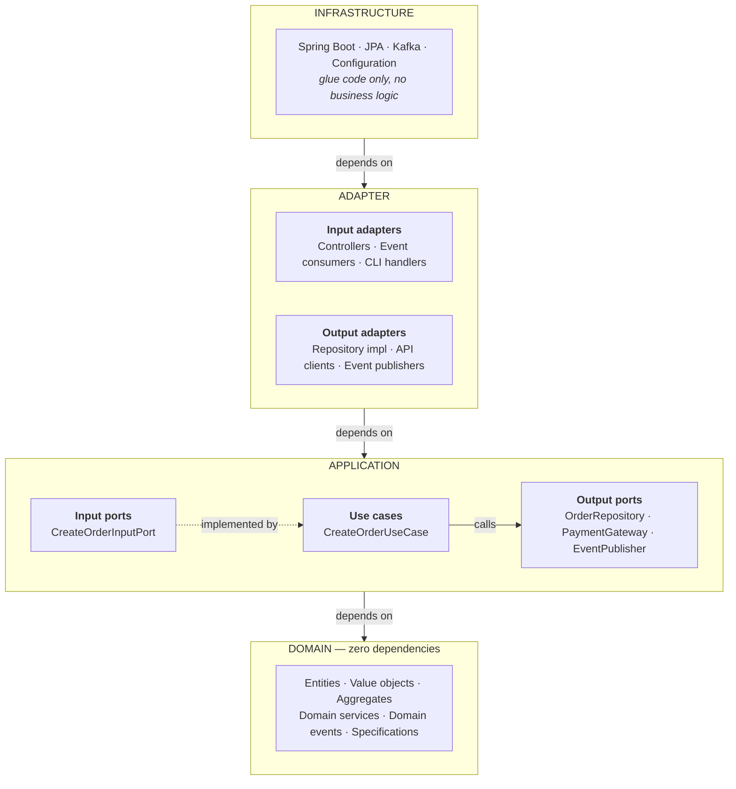

```mermaid
flowchart TD
    subgraph INFRA["INFRASTRUCTURE"]
        I["Spring Boot · JPA · Kafka · Configuration<br><i>glue code only, no business logic</i>"]
    end
    subgraph ADAPTER["ADAPTER"]
        AI["<b>Input adapters</b><br>Controllers · Event consumers · CLI handlers"]
        AO["<b>Output adapters</b><br>Repository impl · API clients · Event publishers"]
    end
    subgraph APP["APPLICATION"]
        PI["<b>Input ports</b><br>CreateOrderInputPort"]
        UC["<b>Use cases</b><br>CreateOrderUseCase"]
        PO["<b>Output ports</b><br>OrderRepository · PaymentGateway · EventPublisher"]
        PI -. implemented by .-> UC
        UC -- calls --> PO
    end
    subgraph DOMAIN["DOMAIN — zero dependencies"]
        DM["Entities · Value objects · Aggregates<br>Domain services · Domain events · Specifications"]
    end

    INFRA -- depends on --> ADAPTER
    ADAPTER -- depends on --> APP
    APP -- depends on --> DOMAIN
```

## Related mentions (heuristic)

- [Repository<T, ID>](/marker/port-out/repository.md)
