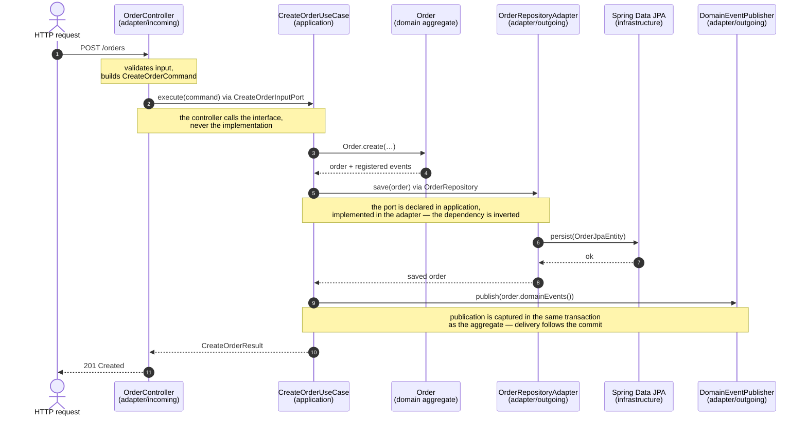

```mermaid
sequenceDiagram
    autonumber
    actor Client as HTTP request
    participant C as OrderController<br>(adapter/incoming)
    participant U as CreateOrderUseCase<br>(application)
    participant O as Order<br>(domain aggregate)
    participant R as OrderRepositoryAdapter<br>(adapter/outgoing)
    participant DB as Spring Data JPA<br>(infrastructure)
    participant P as DomainEventPublisher<br>(adapter/outgoing)

    Client->>C: POST /orders
    Note over C: validates input,<br>builds CreateOrderCommand
    C->>U: execute(command) via CreateOrderInputPort
    Note over C,U: the controller calls the interface,<br>never the implementation
    U->>O: Order.create(…)
    O-->>U: order + registered events
    U->>R: save(order) via OrderRepository
    Note over U,R: the port is declared in application,<br>implemented in the adapter — the dependency is inverted
    R->>DB: persist(OrderJpaEntity)
    DB-->>R: ok
    R-->>U: saved order
    U->>P: publish(order.domainEvents())
    Note over U,P: publication is captured in the same transaction<br>as the aggregate — delivery follows the commit
    U-->>C: CreateOrderResult
    C-->>Client: 201 Created
```

## Related mentions (heuristic)

- [DomainEventPublisher](/marker/port-out/domaineventpublisher.md)
