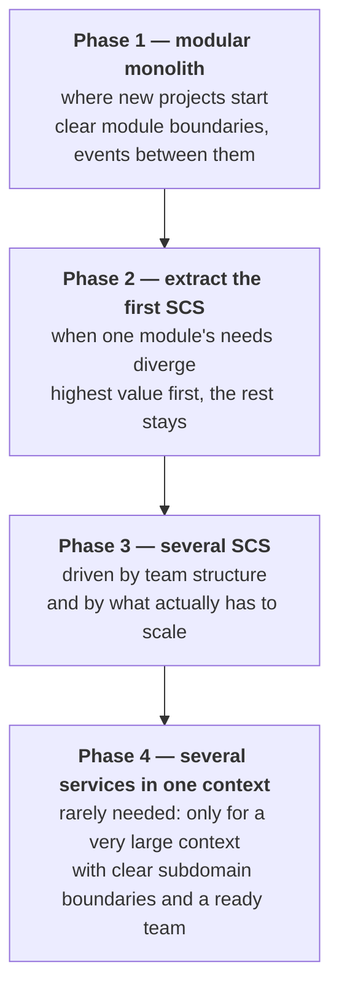

### Recommended Evolution

**Anti-Pattern:** Starting with microservices before understanding domain boundaries.

**Best Practice:** Start simple (modular monolith), extract services when pain points emerge.

> **Implementation Note:** Spring Modulith provides excellent support for Phase 1 (modular monolith) with clear extraction paths to Phase 2. See [Spring Modulith Implementation](/guide/spring-modulith.md).
