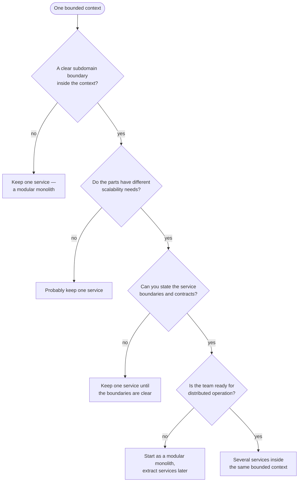
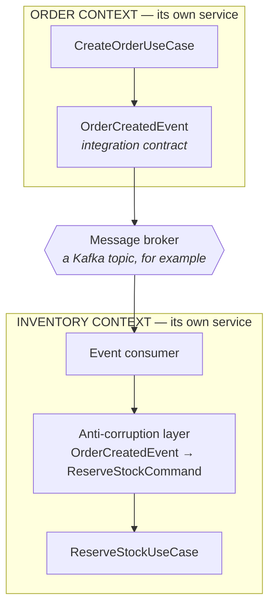

### Why Split a Bounded Context into Multiple Services?

**Reasons:**
1. **Scalability** - Different parts need different scaling strategies
2. **Technology** - Different parts benefit from different tech stacks
3. **Team organization** - Large BC owned by multiple sub-teams
4. **Performance** - Isolated optimization of critical paths
5. **Deployment** - Independent release cycles for different capabilities

**Caution:** Only do this when benefits clearly outweigh complexity.

### Internal Events vs Integration Events

When you split a Bounded Context into multiple services, you need **two types of events**:

#### Integration Events (Cross-Bounded Context)
- **Purpose:** Communication between different bounded contexts
- **Visibility:** Public to all bounded contexts
- **Characteristics:**
  - Versioned and documented
  - Backward compatible
  - Anti-Corruption Layer at consumer
  - Represent public contracts
- **Example:** `OrderCreatedEvent` published by Order BC, consumed by Inventory BC

For core event patterns, see [Domain-Centric Architecture - Event Rules](/guide/rules/domain-layer-rules.md).

#### Internal Events (Within Bounded Context, Across Services)
- **Purpose:** Communication between services within same bounded context
- **Visibility:** Internal to bounded context only
- **Characteristics:**
  - Same ubiquitous language
  - Less strict versioning (same team controls both sides)
  - No Anti-Corruption Layer needed (trust within context)
  - Not exposed to other bounded contexts
- **Example:** `OrderLineAddedInternalEvent` between Order Management Service and Order Pricing Service (both in Order BC)

**Key Distinction:**
```text
Order BC (Single Bounded Context)
├── Order Management Service
│   └── publishes: OrderLineAddedInternalEvent
│
└── Order Pricing Service
    └── consumes: OrderLineAddedInternalEvent

Both services share the ubiquitous language.
Internal event stays within Order BC boundary.

External systems (Inventory BC, Customer BC) NEVER see this internal event.
They only see public Integration Events like OrderCreatedEvent.
```

### Decision Tree: When to Decompose?



**Default Recommendation:** Start with **one service per bounded context** (modular monolith or single SCS). Extract services later when needed.

> **Note:** For Spring Modulith modular monolith patterns, see [Spring Modulith Implementation](/guide/spring-modulith.md).

### Multi-Service Package Structure Example

**Scenario:** Order Bounded Context split into 3 services

```text
order-bounded-context/ (Git Repository)
│
├── order-management-service/
│   └── src/main/java/com/company/order/management/
│       ├── domain/
│       │   └── model/
│       │       ├── Order.java (Aggregate Root)
│       │       ├── OrderLine.java
│       │       └── OrderStatus.java
│       ├── application/
│       │   ├── port/
│       │   │   ├── in/
│       │   │   │   ├── CreateOrderInputPort.java
│       │   │   │   └── AddOrderLineInputPort.java
│       │   │   └── out/
│       │   │       ├── OrderRepository.java
│       │   │       └── InternalEventPublisher.java
│       │   └── usecase/
│       │       ├── CreateOrderUseCase.java
│       │       └── AddOrderLineUseCase.java
│       ├── adapter/
│       │   ├── incoming/
│       │   │   └── web/
│       │   │       └── OrderController.java
│       │   └── outgoing/
│       │       ├── persistence/
│       │       │   └── OrderRepositoryAdapter.java
│       │       └── messaging/
│       │           └── InternalEventPublisherAdapter.java
│       └── infrastructure/
│           └── config/
│
├── order-pricing-service/
│   └── src/main/java/com/company/order/pricing/
│       ├── domain/
│       │   └── model/
│       │       ├── PriceCalculation.java (Aggregate Root)
│       │       └── PricingRule.java
│       ├── application/
│       │   ├── port/
│       │   │   ├── in/
│       │   │   │   └── CalculatePriceInputPort.java
│       │   │   └── out/
│       │   │       └── PriceRepository.java
│       │   └── usecase/
│       │       └── CalculatePriceUseCase.java
│       ├── adapter/
│       │   ├── incoming/
│       │   │   └── messaging/
│       │   │       └── OrderEventConsumer.java
│       │   │           (consumes OrderLineAddedInternalEvent)
│       │   └── outgoing/
│       │       └── persistence/
│       │           └── PriceRepositoryAdapter.java
│       └── infrastructure/
│           └── config/
│
├── order-notification-service/
│   └── src/main/java/com/company/order/notification/
│       ├── domain/
│       ├── application/
│       ├── adapter/
│       │   ├── incoming/
│       │   │   └── messaging/
│       │   │       └── OrderEventConsumer.java
│       │   │           (consumes OrderCreatedInternalEvent)
│       │   └── outgoing/
│       │       └── email/
│       │           └── EmailServiceAdapter.java
│       └── infrastructure/
│
└── shared-internal/ (Shared within Order BC only)
    └── events/
        ├── OrderCreatedInternalEvent.java
        ├── OrderLineAddedInternalEvent.java
        └── OrderCancelledInternalEvent.java
```

**Key Points:**
- All services are in same Git repo (monorepo) OR separate repos with shared library
- All services share ubiquitous language (same BC)
- Internal events (`*InternalEvent`) shared via `shared-internal/` module
- Integration events (`*Event`) published to external BCs separately
- Each service follows domain-centric architecture layers
- Each service can be deployed independently

### Internal Event Communication Pattern

```text
┌─────────────────────────────────────────────────────────────────┐
│                 ORDER BOUNDED CONTEXT                           │
│                                                                 │
│  ┌──────────────────────────┐                                   │
│  │ Order Management Service │                                   │
│  │                          │                                   │
│  │  AddOrderLineUseCase     │                                   │
│  │        │                 │                                   │
│  │        ↓                 │                                   │
│  │  publishes:              │                                   │
│  │  OrderLineAddedInternal  │                                   │
│  │  Event                   │                                   │
│  └───────────┬──────────────┘                                   │
│              │                                                  │
│              │ via Internal Message Broker                      │
│              │ (within same BC, not exposed externally)         │
│              ↓                                                  │
│  ┌────────────────────────────┐                                 │
│  │ Order Pricing Service      │                                 │
│  │                            │                                 │
│  │  OrderEventConsumer        │                                 │
│  │        │                   │                                 │
│  │        ↓                   │                                 │
│  │  consumes:                 │                                 │
│  │  OrderLineAddedInternal    │                                 │
│  │  Event                     │                                 │
│  │        │                   │                                 │
│  │        ↓                   │                                 │
│  │  CalculatePriceUseCase     │                                 │
│  └────────────────────────────┘                                 │
│                                                                 │
│  No ACL needed - same ubiquitous language within BC             │
└─────────────────────────────────────────────────────────────────┘
```

**Contrast with Integration Events:**


The anti-corruption layer is not optional here: the two contexts speak different ubiquitous
languages, and the contract is written in the producer's.

## Related mentions (heuristic)

- [Repository<T, ID>](/marker/port-out/repository.md)
