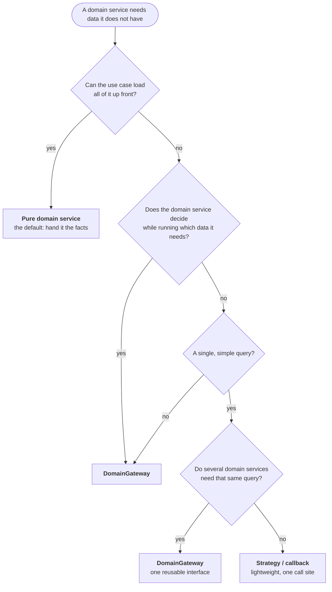

| Criterion                        | Pure Domain Service     | DomainGateway              | Strategy/Callback          |
|----------------------------------|-------------------------|----------------------------|----------------------------|
| **Complexity of data query**     | Simple (1-2 sources)    | Medium to complex          | Simple (1 source)          |
| **Dependencies in the domain**   | None                    | Abstract interface         | None                       |
| **Testability**                  | Trivial                 | Mock the gateway           | Lambda inline              |
| **Readability**                  | Very good               | Good (explicit interface)  | Moderate (long signatures) |
| **Reusability**                  | High                    | High (interface shared)    | Low (per call)             |
| **Number of classes**            | Minimal                 | +2 (interface + impl)      | Optional +1 (func. interf.)|
| **Domain model explicitness**    | —                       | High (Ubiquitous Language) | Low                        |
| **Recommended when...**          | Data can be loaded up front | Domain decides what data it needs, several services share the same query | Single, simple query used by one service |

### Decision Tree

---

## Related mentions (heuristic)

- [DomainGateway](/marker/tactical/domaingateway.md)
