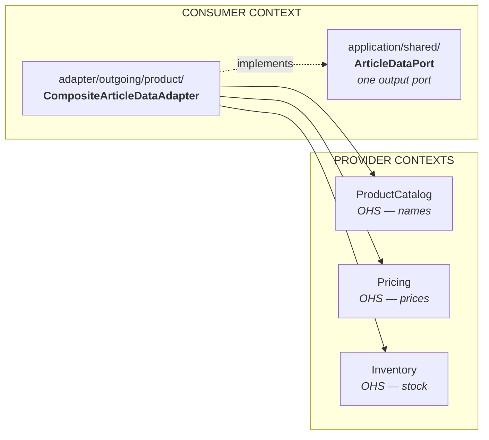

When a context needs data from **multiple** Open Host Services, use a **Composite Adapter** to aggregate the data in one place.



The consumer's application layer sees one port and one shape of data. That three contexts were
asked, and in which order, is the adapter's business alone.

**Example:**
```java
// adapter/outgoing/product/CompositeArticleDataAdapter.java
@Component
public class CompositeArticleDataAdapter implements ArticleDataPort {

    private final ProductCatalogService productCatalogService;  // OHS
    private final PricingService pricingService;                // OHS
    private final InventoryService inventoryService;            // OHS

    @Override
    public Map<ProductId, ArticleData> getArticleData(Collection<ProductId> productIds) {
        // Bulk fetch from each OHS
        Map<ProductId, PriceInfo> prices = pricingService.getPrices(productIds);
        Map<ProductId, StockInfo> stocks = inventoryService.getStock(productIds);

        Map<ProductId, ArticleData> result = new HashMap<>();
        for (ProductId productId : productIds) {
            Optional<ProductInfo> productInfo = productCatalogService.getProductInfo(productId);
            if (productInfo.isPresent()) {
                result.put(productId, combineData(productId, productInfo.get(),
                    prices.get(productId), stocks.get(productId)));
            }
        }
        return result;
    }
}
```

**Rules:**
- ✅ Composite adapter is the **ONLY** place that imports from multiple OHS
- ✅ Aggregates data from multiple sources into context-specific DTO
- ✅ Use cases depend on port interface, not the adapter
- ✅ Isolates cross-context coupling to adapter layer
- ❌ Use cases never import OHS directly
