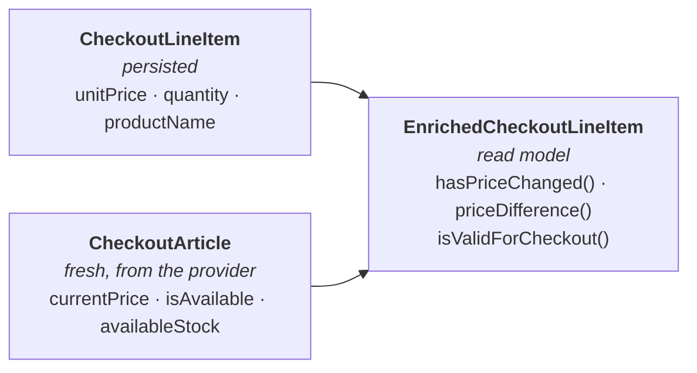

When you need to **combine persisted data with fresh external data** for rich domain logic (e.g., comparing original price to current price), create an **Enriched Read Model**.



The read model answers questions neither side can answer alone. It is a value object in
`{context}/domain/model/`, assembled by a static factory from the aggregate plus a plain carrier of
the external data — fetched through this context's own output port, never by importing the other
context. No identity, no lifecycle, no events: it owns the read rules that span both sides, and
nothing else.

**Example:**
```java
// Enriched line item - combines persisted with current data
public record EnrichedCheckoutLineItem(
    CheckoutLineItem lineItem,     // Persisted at checkout start
    CheckoutArticle currentArticle  // Fresh from external services
) implements Value {

    public Money currentLineTotal() {
        return currentArticle.currentPrice().multiply(lineItem.quantity());
    }

    public boolean hasPriceChanged() {
        return !lineItem.unitPrice().equals(currentArticle.currentPrice());
    }

    public Money priceDifference() {
        return currentArticle.currentPrice().subtract(lineItem.unitPrice());
    }

    public boolean isValidForCheckout() {
        return currentArticle.isAvailable() &&
               currentArticle.availableStock() >= lineItem.quantity();
    }
}

// Enriched cart - collection with business logic
public record CheckoutCart(
    CartId cartId,
    CustomerId customerId,
    List<EnrichedCheckoutLineItem> items
) implements Value {

    public boolean hasAnyPriceChanges() {
        return items.stream().anyMatch(EnrichedCheckoutLineItem::hasPriceChanged);
    }

    public Money calculateCurrentSubtotal() {
        return items.stream()
            .map(EnrichedCheckoutLineItem::currentLineTotal)
            .reduce(Money::add)
            .orElse(Money.zero());
    }

    public boolean isValidForCheckout() {
        return !items.isEmpty() &&
               items.stream().allMatch(EnrichedCheckoutLineItem::isValidForCheckout);
    }

    public List<EnrichedCheckoutLineItem> invalidItems() {
        return items.stream()
            .filter(item -> !item.isValidForCheckout())
            .toList();
    }
}
```

**Benefits:**
- ✅ **Rich domain logic** - "Has price changed?" "Is stock sufficient?"
- ✅ **Single query point** - all validation/calculation in one place
- ✅ **Immutable** - Value Object, safe to pass around
- ✅ **Real-world metaphor** - like a smart shopping cart display

**Note:** An enriched read model is a Value Object, not an Aggregate. It has no lifecycle or events.
Its name follows the domain: `ExtendedCart` and `CartWithCurrentPrices` are equally valid
alternatives to `EnrichedCart`. Neither an `Enriched` prefix nor record syntax defines the
role. Implement `Value` and follow its identity, immutability and equality contracts;
immutable classes with equality are valid too. Enrichment itself is guidance.
