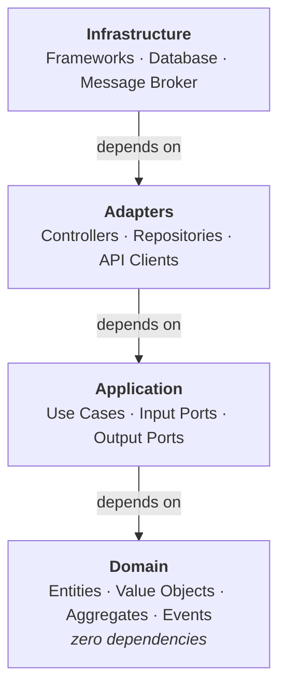

### Core Principles

1. **Dependencies Point Inward** - All code dependencies point toward the domain layer. The domain has zero outward dependencies.

2. **Domain is King** - Business logic lives in a rich domain model using tactical DDD patterns (Entities, Value Objects, Aggregates, Domain Services, Domain Events).

3. **Ports & Adapters** - Application layer defines interfaces (ports), infrastructure implements them (adapters). This inverts dependencies.

4. **Bounded Contexts** - Large systems are partitioned into bounded contexts, each with its own ubiquitous language and model.

5. **Decoupled Integration** - Bounded contexts stay independent: they communicate asynchronously, through integration events or another asynchronous channel, and synchronously only where the declared relationship says so — an open host service the downstream consumes and translates. Events are the means of decoupling, inside the model as domain events and across contexts as integration events, not an obligation on every interaction.

6. **Progressive Complexity** - Start simple with flat structures, add complexity only when needed based on actual pain points.

### Four Layers

### When to Use

**Ideal for:**
- Complex business domains with rich logic
- Systems that will evolve and scale over time
- Multiple teams working on different parts
- Event-driven or microservices architectures

**Consider alternatives for:**
- Simple CRUD applications
- Very small systems with minimal business logic
- Short-lived projects or prototypes

### Quick Start

1. **Identify bounded contexts** - Partition your domain by language and model boundaries
2. **Start with 4 layers** - domain, application, adapter, infrastructure (keep it flat initially)
3. **Apply tactical DDD** - Use Entities, Value Objects, Aggregates in domain layer
4. **Define ports** - Input Ports for use cases, Output Ports for infrastructure needs
5. **Implement adapters** - Web controllers, persistence, messaging as adapters
6. **Add complexity progressively** - Subdivide packages only when you feel pain

Where each of these is settled in full is listed below.
