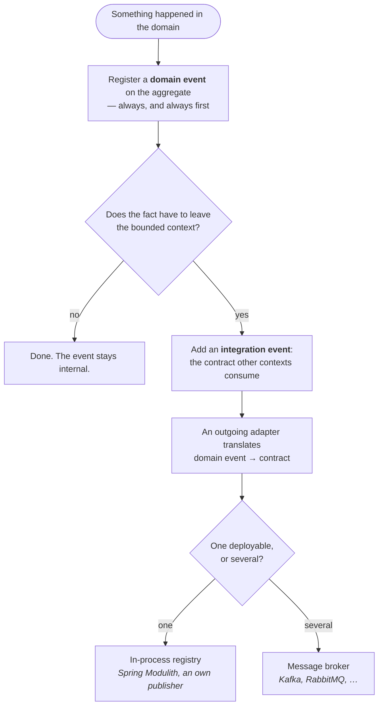

### Entity Rules
- Entity has unique identity
- Identity remains constant throughout lifecycle
- Entities compared by identity only
- Entity can change attributes while keeping identity
- Entity equality based on ID only
- Entity validates its own invariants

### Value Object Rules
- Value Objects are immutable
- Value Objects have no identity
- Value Objects compared by all attributes
- Replace entire Value Object instead of modifying
- Value Objects can be shared freely
- Value Objects validate themselves; state the numeric range and rounding of every monetary value object. Reconstitution, deserialisation and default struct construction must not bypass invalid-state checks.
- Side-effect-free methods only

### Aggregate Rules
- Access external objects only through Aggregate Root
- Aggregate Root is an Entity
- Aggregate defines transactional boundary
- Aggregate maintains invariants at all times
- Small aggregates preferred
- Reference other aggregates by ID only, not object reference
- One transaction modifies one aggregate only
- Eventual consistency between aggregates
- Delete aggregate deletes all contained entities
- Never inject repositories or remote services into aggregates. Use cases retrieve facts; domain services calculate over supplied snapshots. A callback parameter does not make external-data responsibility belong on the aggregate.
- Two factories, two purposes: `create(...)` enforces creation invariants and registers the creation event; `reconstitute(...)` rebuilds a stored aggregate from persisted state and registers nothing. Persistence adapters use only the latter — rebuilding through `create` publishes a phantom creation on the next save
- Domain events leave the aggregate through one call, `DomainEventPublisher.publishAndClearEvents(aggregate)`, after the save: dispatch everything, clear only when every listener returned. Iterating `domainEvents()` and calling `publish` per event is not the sanctioned form
- Protect against lost updates with optimistic concurrency: version field on the root, incremented per state change; persistence rejects saves with a stale expected version

### Domain Service Rules
- Domain Service is stateless
- Use when operation doesn't belong to Entity or Value Object
- Use when operation involves multiple domain objects
- Domain Service operates in domain language
- Domain Service is part of domain layer
- No dependencies on application or outer layers

### Domain Event Rules (Internal to Bounded Context)
- Domain Events are immutable
- Domain Events use past tense naming (e.g., OrderCreated, not CreateOrder)
- Domain Events represent something that happened in the domain
- Domain Events are defined in `{context}/domain/event/` package
- Domain Events enable eventual consistency within bounded context
- Domain Events emitted by aggregates during state changes
- Domain Events published by use cases via DomainEventPublisher (Output Port)
- Domain Events handled asynchronously when crossing aggregates
- Domain Events must not contain behavior, only data
- Domain Events belong to the domain layer, not adapters

### Integration Event Rules (Cross-Bounded Context)
- Integration Events are DTOs representing domain events for external systems
- Integration Events defined in `{context}/events/` package
- Integration Events use past tense + "Event" suffix (e.g., OrderCreatedEvent)
- Integration Events must be serializable (JSON, Protobuf, Avro)
- Integration Events include: event ID, timestamp, correlation ID; the schema version and
  stable logical name are a **class property** via `@IntegrationEventType(name, version)` —
  never a `version` data field on the instance
- Integration Events created by Event Mappers in outgoing adapters
- Domain events never cross bounded context boundaries directly
- Event Mapper converts domain event → integration event DTO
- Integration Events must be backward compatible (add fields, don't remove)
- Integration Events contain only primitives and value types, no domain objects

**Integration Event Payload Styles** — choose per event type:

| Style | Payload | When |
|---|---|---|
| **Notification** | IDs only — consumer queries back via Open Host Service | Sensitive or large data; query-back doubles as authorization gate |
| **Event-Carried State Transfer** | Relevant state snapshot | Consumer maintains a local cache/replica, avoids chatty query-backs |
| **Domain Fact** | The business fact and its data | Consumer reacts to what happened, no replica needed |

Invariant in all styles: flat, serializable, versioned — never aggregate references.

**Decision Tree: Domain Event or Integration Event?**

**Domain event** — `{context}/domain/event/`, named in the past tense (`OrderCreated`), may carry
domain objects, carries a timestamp (`DCA-ADV-008`) and no schema version (`DCA-ADV-007`).

**Integration event** — the published contract. It lives in the context's `events/` segment
(`DCA-STR-007`), carries the `Event` suffix and `@IntegrationEventType(name, version)`
(`DCA-ADV-005`), holds only primitives and serializable types, and is immutable (`DCA-STR-008`).
The schema version belongs to that type metadata, never to the payload (`DCA-ADV-006`).

**The translator** is an outgoing adapter in `adapter/outgoing/event/`: it listens for the domain
event and publishes the contract. Transport and storage are separate adapters again.

**Delivery follows the deployment, not the boundary.** Inside one deployable, an in-process registry
carries the contract across a context boundary — that is what the reference implementation does, and
the boundary is no less real for it. Once the contexts are deployed separately, the same contract
goes over a broker: Kafka, RabbitMQ, whatever the operation runs. The contract does not change, the
adapter behind it does. Nothing above this line depends on the answer.

### Event Publishing Rules
- Use cases call DomainEventPublisher (Output Port) to publish events
- `DomainEventPublisher` is the library port (`hexagonal.port.out`); the application implements it once, in the shared kernel
- DomainEventPublisherAdapter in adapter/outgoing/messaging
- Adapter converts domain events to integration events via mapper
- Message broker (Kafka, RabbitMQ) used for async delivery
- One topic per bounded context or per event type
- Order inside the use case: `save`, then `publishAndClearEvents` — same transaction, never before the save
- The publisher dispatches first and clears the aggregate afterwards; the clear is the acknowledgement that every listener saw the event. A throwing listener fails the use case and leaves the events on the aggregate
- Integration events go through a **transactional outbox**: the publication is written *inside* the aggregate's transaction (Spring Modulith's event publication registry, an outbox table, an in-process stand-in), made eligible atomically with commit and followed by an after-commit wakeup, discarded on rollback. Registering only after commit leaves a crash window between commit and outbox entry
- Delivery is asynchronous and at least once: failures are retried with backoff, permanently failing publications stay visible (`Failed`), outstanding ones are replayed on restart

### Event Consumption Rules
- Event Consumer in adapter/incoming/messaging receives integration events
- Anti-Corruption Layer (ACL) protects domain from external formats
- ACL in adapter/incoming/messaging/acl converts events to domain commands
- Event Consumer calls Input Port, never domain directly
- Consuming bounded context maintains its own model
- Eventual consistency between bounded contexts via events
- Assume at-least-once delivery: consumers deduplicate (event ID or naturally idempotent operations)
- Consumers tolerate out-of-order arrival (check event version/timestamp, never assume sequence)
- Permanently failing events go to a dead-letter queue — never dropped silently
- An event handler modifies at most one aggregate, in its own transaction

### General Domain Rules
- Domain contains business logic only
- Domain is framework-agnostic
- Domain is persistence-agnostic
- Domain is UI-agnostic
- Domain uses pure language features
- Domain can be tested without infrastructure
- Domain reflects business, not database structure
- Ubiquitous Language used throughout domain code

## Related mentions (heuristic)

- [DomainEventPublisher](/marker/port-out/domaineventpublisher.md)
- [@IntegrationEventType](/marker/tactical/integrationeventtype.md)
