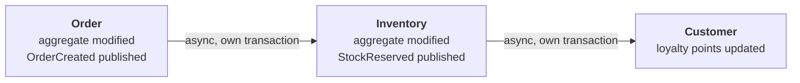

### Transaction Boundary Placement
- **Transaction boundaries live at the use case level** (application layer)
- One transaction = one aggregate modification (single aggregate rule)
- **Every use case that saves or deletes an aggregate draws the boundary, events or not** — a repository may write one aggregate (root, entities, value objects) as several statements across several tables and draws no boundary of its own; the use case owns the unit of work (`DCA-USE-012`)
- Use `@Transactional` (or equivalent) on use case implementations **whose work is entirely local** — repositories, stores, event publishers
- **Never call a remote-capable port inside the transaction.** A port that may leave the process (another context's API, a payment provider, a mail gateway) called inside `@Transactional` holds the database connection for the remote round trip; under load the pool runs dry, and a rollback cannot undo the remote effect
- Use cases that need such a port **draw the boundary by hand** with `TransactionBoundary` (an application-layer execution abstraction — not a port; implemented in infrastructure): remote reads first, then `transactionBoundary.inTransaction(load, mutate, save, publish)`; remote effects after the commit, as a reaction to an integration event
- Domain layer is transaction-agnostic

### Cross-Aggregate Consistency
- **Within same bounded context**: eventual consistency via domain events
- **Across bounded contexts**: eventual consistency via integration events
- Never modify multiple aggregates in one transaction

### Transaction Pattern Example
```java
@Service
public class CreateOrderUseCase implements CreateOrderInputPort {

    private final OrderRepository orderRepository;
    private final DomainEventPublisher eventPublisher;

    @Transactional  // Transaction boundary at use case level
    @Override
    public CreateOrderResult execute(CreateOrderCommand command) {
        // 1. Domain logic (within transaction)
        Order order = Order.create(command.customerId(), command.items());

        // 2. Persist single aggregate
        orderRepository.save(order);

        // 3. Publish events (after persistence, before commit)
        eventPublisher.publishAndClearEvents(order);

        return CreateOrderResult.from(order);
    }
}
```

### Eventual Consistency Example


One aggregate per transaction. Each consumer commits its own, and the chain is consistent only
once the last one has.

### Remote Port Example — Boundary Drawn by Hand
```java
@Service                                   // no class-level @Transactional
public class AddItemToCartUseCase implements AddItemToCartInputPort {

    private final ShoppingCartRepository carts;
    private final ArticleDataPort articles;          // reaches another context — remote-capable
    private final DomainEventPublisher eventPublisher;
    private final TransactionBoundary transactionBoundary;             // application-layer abstraction (not a port) → TransactionTemplate

    @Override
    public AddItemToCartResult execute(AddItemToCartCommand command) {
        // 1. Remote-capable read — outside the transaction
        CartArticle article = articles.getArticleData(command.productId()).orElseThrow();

        // 2. Short transaction: load, mutate, save, publish
        return transactionBoundary.inTransaction(() -> {
            ShoppingCart cart = carts.findById(command.cartId()).orElseThrow();
            cart.addItem(command.productId(), command.quantity(), Price.of(article.currentPrice()));
            carts.save(cart);
            eventPublisher.publishAndClearEvents(cart);
            return AddItemToCartResult.from(cart);
        });
    }
}
```

Two rules of the DCA catalog make this a compile-time fact: `DCA-USE-012` — a use case that saves or deletes an aggregate through a `Repository`, or publishes domain events, has a transaction boundary — declarative `@Transactional` **or** an explicit `TransactionBoundary.inTransaction` (the repository may write one aggregate as several statements; the use case owns the unit of work even when no event is published); `DCA-USE-013` — a `@Transactional` use case calls no output port other than `Repository`, `Store`, `DomainEventPublisher`, `IntegrationEventPublisher` (`TransactionBoundary` is not a port; a use case that needs remote reads draws the explicit boundary instead of the annotation). In .NET the boundary is a decorator around `IUseCase<,>` or `ITransactionBoundary.InTransactionAsync`; `DCA-NET-006` keeps EF Core, `System.Data` and `System.Transactions` out of the application layer.

**Note:** For complex multi-aggregate workflows, consider the **Saga pattern** (orchestration or choreography). This is an advanced topic beyond the scope of basic domain-centric architecture.

## Related mentions (heuristic)

- [TransactionBoundary](/marker/application/transactionboundary.md)
- [DomainEventPublisher](/marker/port-out/domaineventpublisher.md)
- [IntegrationEventPublisher](/marker/port-out/integrationeventpublisher.md)
- [Repository<T, ID>](/marker/port-out/repository.md)
