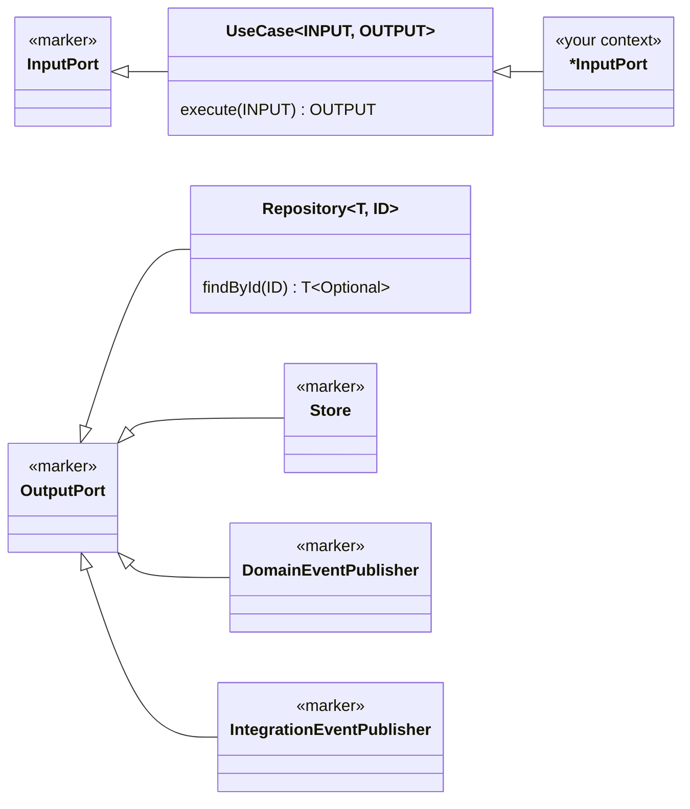

The **Shared Kernel** contains code shared across ALL bounded contexts within your application. It should be kept minimal and requires coordination between teams.

**The building blocks are a dependency, not shared-kernel code.** The architectural markers — tactical
DDD interfaces, strategic annotations and the port hierarchy — are generic: they assign a role and carry
no business method. They ship as a published library, and the shared kernel of an application holds only
what is specific to *that* application:

```kotlin
// build.gradle.kts
dependencies {
    implementation("dev.domaincentric:dca-building-blocks:0.1.2")     // markers, ports, TransactionBoundary
    testImplementation("dev.domaincentric:dca-archunit:0.3.0")        // the rules that select on them
}
```

```xml
<!-- pom.xml -->
<dependency>
  <groupId>dev.domaincentric</groupId>
  <artifactId>dca-building-blocks</artifactId>
  <version>0.1.2</version>
</dependency>
```

```text
dotnet add package DomainCentric.BuildingBlocks            # .NET twin: I-prefixed interfaces, attributes, async ports
dotnet add package DomainCentric.ArchRules.Xunit           # same rule ids, xUnit base class
```

What the library defines, by package (Java) and namespace (.NET):

```text
dev.domaincentric.dca.buildingblocks            DomainCentric.BuildingBlocks
├── ddd.tactical                                ├── Ddd.Tactical
│   Id, Entity, Value, AggregateRoot,           │   IId, IEntity, IValue, IAggregateRoot,
│   BaseAggregateRoot, DomainEvent,             │   AggregateRootBase, IDomainEvent,
│   IntegrationEvent, @IntegrationEventType,    │   IIntegrationEvent, [IntegrationEventType],
│   DomainService, DomainGateway, Factory,      │   IDomainService, IDomainGateway, IFactory,
│   Specification                               │   ISpecification<T>
├── ddd.strategic                               ├── Ddd.Strategic
│   @BoundedContext (on package-info)           │   [BoundedContext] (on a context marker class)
├── ddd.strategic.relationships                 ├── Ddd.Strategic.Relationships
│   @SharedKernel, @OpenHostService, @Upstream, │   [SharedKernel], [OpenHostService], [Upstream],
│   @ExternalUpstream, @Partnership             │   [ExternalUpstream], [Partnership]
├── hexagonal.port.in                           ├── Hexagonal.Ports.In
│   InputPort, UseCase<INPUT, OUTPUT>           │   IInputPort, IUseCase<TInput, TOutput>
├── hexagonal.port.out                          ├── Hexagonal.Ports.Out
│   OutputPort, Repository<T, ID>, Store,       │   IOutputPort, IRepository<T, TId>, IStore,
│   DomainEventPublisher,                       │   IDomainEventPublisher,
│   IntegrationEventPublisher                   │   IIntegrationEventPublisher
└── application                                 └── Application.Transactions
    TransactionBoundary (execution abstraction,     ITransactionBoundary
    not a port)
```

The rest of this guide names the Java types; the .NET names follow the host language's convention
(`I` prefix, attributes, `Async` suffix) — see [Language Mappings](/guide/language-mappings.md).

**Structure of the application's shared kernel:**
```text
sharedkernel/                      # @SharedKernel on package-info.java
├── application/
│   └── shared/                    # Application-specific ports shared by several contexts
│       └── IdentityProvider.java  # e.g. current caller's identity — NOT a generic marker
│
├── domain/
│   ├── model/                     # Universal Value Objects
│   │   ├── Money.java             # Universal money type
│   │   ├── Price.java             # Common price value object
│   │   ├── ProductId.java         # Shared product identifier
│   │   └── UserId.java            # Shared user identifier
│   └── specification/             # Specification Pattern Implementation
│       ├── CompositeSpecification.java
│       ├── AndSpecification.java
│       ├── OrSpecification.java
│       ├── NotSpecification.java
│       └── SpecificationVisitor.java
│
└── (no adapters: the DomainEventPublisher and TransactionBoundary implementations
     come from the dca-spring dependency — see below)
```

**The runtime adapters are a dependency too.** The two ports that every use case needs at runtime —
`DomainEventPublisher` and `TransactionBoundary` — have Spring implementations in
`dev.domaincentric:dca-spring`: `SpringDomainEventPublisher` (over `ApplicationEventPublisher`, dispatch
first, clear afterwards) and `SpringTransactionBoundary` (over `TransactionTemplate`, `REQUIRED`
propagation, nested failures mark the transaction rollback-only), plus an `InMemoryTransactionBoundary`
for tests. A Spring Boot application needs nothing but the dependency: the auto-configuration registers
both beans, the boundary once a `PlatformTransactionManager` exists, and backs off where the application
defines a port itself. An application on another framework writes the two classes in its shared kernel
(`sharedkernel/adapter/outgoing/event/`, `sharedkernel/infrastructure/transaction/`).

```kotlin
implementation("dev.domaincentric:dca-spring:0.1.0")
```

> **The silent failure this guards.** `spring-boot-starter` and `spring-modulith-starter-core` bring no
> transaction manager and not even Boot's `TransactionAutoConfiguration` (it lives in
> `spring-boot-transaction`). In that in-memory starting configuration `@Transactional` compiles and does
> nothing: no proxy, no transaction, and every `@TransactionalEventListener` / `@ApplicationModuleListener`
> is skipped without a log line — while the rules stay green. Until a database arrives, add
> `spring-boot-transaction`, a small `PlatformTransactionManager` bean of your own (deliberately visible
> code, not a library class) and `spring-modulith-events-api` for the listener annotation itself.

**Port Interface Hierarchy** (defined by the library):


`InputPort` and `UseCase` live in `hexagonal.port.in`, the output side in
`hexagonal.port.out`. Only the last box on the input side is yours: a context declares
`*InputPort extends UseCase<Command, Result>` and implements it with its use case.

Only *generic* contracts are building blocks: interfaces that assign an architectural role and
carry no business methods. A port with domain-specific methods — even one that several bounded
contexts share — is an **application-specific shared port** and belongs in
`sharedkernel/application/shared/`, mirroring the `application/shared/` convention each bounded
context uses for its own ports. The rules and the tooling select on the library's types, so this
separation keeps project concepts out of the reusable building-block set — and a new generic marker
is a contribution to the library, not a file in your shared kernel.

**Example — an application-specific shared port (Identity):**
```java
// In sharedkernel/application/shared/IdentityProvider.java — project-specific, not a marker
public interface IdentityProvider extends OutputPort {
    Identity getCurrentIdentity();

    // Nested interface - contract for identity
    interface Identity {
        UserId userId();
        IdentityType type();
        Optional<String> email();
        Set<String> roles();
        default boolean isAnonymous() { return type().isAnonymous(); }
        default boolean isRegistered() { return type().isRegistered(); }
    }

    // Nested interface - extensible identity type
    interface IdentityType {
        String name();
        boolean isAnonymous();
        boolean isRegistered();
    }
}

// In the owning context's adapter/outgoing/security/ - PROJECT-SPECIFIC implementations
public enum JwtIdentityType implements IdentityProvider.IdentityType {
    ANONYMOUS, REGISTERED, SERVICE_ACCOUNT;  // Extensible per project
}

public record JwtIdentity(...) implements IdentityProvider.Identity { ... }
```

**Why the identity port is not a building block.** Its contract returns `UserId` — a value object of
*this* project's shared kernel — and its `IdentityType` encodes *this* shop's two-cookie design (anonymous
visitor vs. registered customer). A reusable marker must carry neither, and a marker only earns its place
once a rule selects on it; every rule about identity that exists today ("the domain never reads the
caller") works over the layer packages alone. So the port is written per project, following the cut below.

**How to cut the identity port:**

1. **One output port, in the shared kernel's `application/shared/`** (or in a single context's
   `application/shared/` if only that context needs it). It extends `OutputPort`, returns an `Identity`
   made of the project's own types, and knows nothing about tokens, cookies or headers.
2. **The implementation is an outgoing adapter of the context that owns authentication** — it reads the
   security context the framework populated (`adapter/outgoing/security/`). Incoming adapters and use cases
   see only the port.
3. **The authentication filter enriches, it never gates.** It attaches an identity or nothing and lets the
   request proceed; every request has an identity (an anonymous visitor is one). Blanket
   "must be authenticated" rules at the token boundary are not where authorization lives.
4. **Ownership goes into the command.** A use case that acts on somebody's resource takes the caller as a
   field — `GetCartByIdQuery(cartId, customerId)`, `StartCheckoutCommand(cartId, customerId)` — and asks the
   repository a *scoped* question (`findByIdForCustomer(cartId, customerId)`) instead of loading by id and
   comparing afterwards. The incoming adapter resolves the caller through the port and fills the field; the
   use case never calls the identity port to find out on whose behalf it runs.
5. **A claims-only gate may stay in the adapter.** "Does this token carry the staff role?" reads nothing but
   the caller's claims and is a property of the *exposure*, so the REST resource or page controller may
   check it and refuse. Anything that needs the resource — is this cart theirs — is a property of the
   *operation* and belongs to the use case, through the command field of step 4.
6. **The domain never sees the caller.** No `User` parameter on an aggregate method, no role check in a
   value object; `cart.checkout()` protects *its* invariants (not empty, not already completed), the use
   case has already answered *who may*.
7. **A use case without a caller says so.** An event consumer completing a cart after a confirmed checkout
   acts on nobody's behalf; leave its command unscoped and document why, or the next reader "fixes" it.

Refusals are decided in the use case and *rendered* in the adapter: whether a stranger's cart answers
`403` or `404` is a protocol choice (a `403` confirms the id exists), and the REST resource makes it.

- **InputPort** - Marker interface for all entry points to the application (called by driving adapters)
- **OutputPort** - Marker interface for all dependencies the application needs (implemented by driven adapters)
- **UseCase<INPUT, OUTPUT>** - Specific input port type with Command/Query → Result pattern
- **Repository<T, ID>** - Collection-like output port for Aggregate Roots (one-per-aggregate)
- **Store** - Output port for operational data without aggregate lifecycle (Value Objects, Events, technical state)

## Related mentions (heuristic)

- [TransactionBoundary](/marker/application/transactionboundary.md)
- [InputPort](/marker/port-in/inputport.md)
- [UseCase<INPUT, OUTPUT>](/marker/port-in/usecase.md)
- [DomainEventPublisher](/marker/port-out/domaineventpublisher.md)
- [IntegrationEventPublisher](/marker/port-out/integrationeventpublisher.md)
- [OutputPort](/marker/port-out/outputport.md)
- [Repository<T, ID>](/marker/port-out/repository.md)
- [@BoundedContext](/marker/strategic/boundedcontext.md)
- [@ExternalUpstream](/marker/strategic/externalupstream.md)
- [@OpenHostService](/marker/strategic/openhostservice.md)
- [@Partnership](/marker/strategic/partnership.md)
- [@SharedKernel](/marker/strategic/sharedkernel.md)
- [@Upstream](/marker/strategic/upstream.md)
- [AggregateRoot<T, ID>](/marker/tactical/aggregateroot.md)
- [BaseAggregateRoot<T, ID>](/marker/tactical/baseaggregateroot.md)
- [DomainEvent](/marker/tactical/domainevent.md)
- [DomainGateway](/marker/tactical/domaingateway.md)
- [DomainService](/marker/tactical/domainservice.md)
- [Factory](/marker/tactical/factory.md)
- [IntegrationEvent](/marker/tactical/integrationevent.md)
- [@IntegrationEventType](/marker/tactical/integrationeventtype.md)
- [Specification<T>](/marker/tactical/specification.md)
