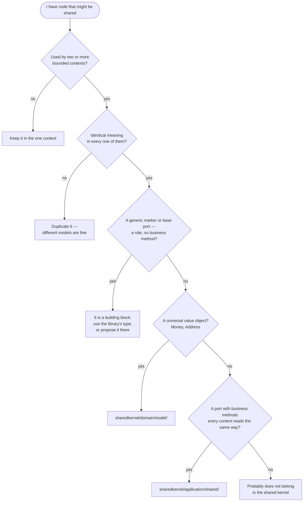

**What Belongs in Shared Kernel:**

✅ **Include:**
- **Universal value objects** used by multiple contexts (Money, Price, shared IDs)
- **Application-specific shared ports** with identical meaning in every context (an `IdentityProvider`)
- **Shared adapters** that implement a library port once for the whole application — on Spring these come from `dca-spring` (`SpringDomainEventPublisher`, `SpringTransactionBoundary`); other frameworks write them here
- **Specification pattern implementations** (CompositeSpecification, And/Or/Not specifications)
- **Cross-cutting domain concepts** that have identical meaning everywhere

📦 **Comes from the dependency, not written here:**
- **DDD marker interfaces** (Entity, AggregateRoot, Value, DomainEvent, …) and **strategic annotations**
- **Base port interfaces** (`UseCase<INPUT, OUTPUT>`, `Repository`, `Store`, `DomainEventPublisher`) and `TransactionBoundary`

❌ **Exclude:**
- **Aggregates** - These belong to specific bounded contexts
- **Business logic** - Should live in context-specific domain layers
- **Context-specific value objects** - Only truly universal ones belong here
- **Use case implementations** - Belong to specific contexts
- **Adapters** - Never shared between contexts

**Guidelines:**
- Keep the Shared Kernel **as small as possible**
- Changes to Shared Kernel affect all contexts - coordinate carefully
- Only include code that has **identical meaning** across all contexts
- When in doubt, duplicate rather than share
- Use versioning if Shared Kernel becomes a separate module

**Decision Tree: Should This Go in Shared Kernel?**


**Example - Shared Value Object:**
```java
// sharedkernel/domain/model/Money.java
public record Money(BigDecimal amount, Currency currency) implements Value {

    public Money {
        Objects.requireNonNull(amount);
        Objects.requireNonNull(currency);
        if (amount.scale() > 2) {
            throw new IllegalArgumentException("Money cannot have more than 2 decimal places");
        }
    }

    public Money add(Money other) {
        if (!this.currency.equals(other.currency)) {
            throw new IllegalArgumentException("Cannot add money with different currencies");
        }
        return new Money(this.amount.add(other.amount), this.currency);
    }
}
```

## Related mentions (heuristic)

- [TransactionBoundary](/marker/application/transactionboundary.md)
- [UseCase<INPUT, OUTPUT>](/marker/port-in/usecase.md)
- [DomainEventPublisher](/marker/port-out/domaineventpublisher.md)
- [Repository<T, ID>](/marker/port-out/repository.md)
- [AggregateRoot<T, ID>](/marker/tactical/aggregateroot.md)
- [DomainEvent](/marker/tactical/domainevent.md)
- [Specification<T>](/marker/tactical/specification.md)
